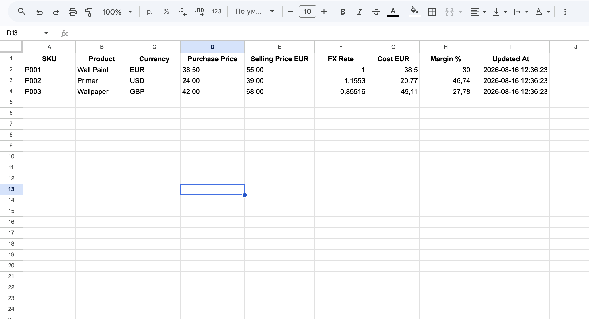
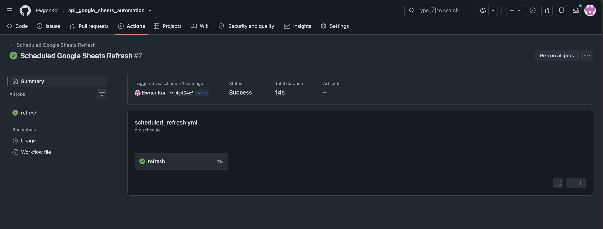
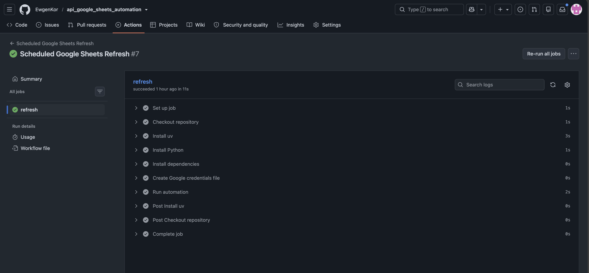

# API → Google Sheets Automation

A lightweight Python automation that retrieves exchange rates from an external REST API, validates and transforms the data, recalculates product costs and margins, and automatically updates a Google Sheet on a schedule.

## Business Problem

Small businesses often maintain purchasing and pricing data in Google Sheets while working with suppliers in multiple currencies.

Typical manual workflow:

- update exchange rates;
- recalculate purchase costs;
- recalculate margins;
- repeat the process every day or several times per day.

This project automates that workflow.

## Solution

The automation reads product data from Google Sheets, fetches the required exchange rates from an external API, validates the response, performs business calculations, and writes the updated results back to the same spreadsheet.

```text
Google Sheet
    ↓
Read product data
    ↓
Frankfurter REST API
    ↓
Validate exchange rates
    ↓
Convert purchase costs to EUR
    ↓
Calculate margin %
    ↓
Update Google Sheet
    ↓
Scheduled refresh via GitHub Actions
```

## Demo

### Automated Google Sheet

The sheet contains the original product data together with automatically calculated exchange rates, EUR costs, margins, and the last refresh timestamp.



### Scheduled Automation

The workflow runs automatically with GitHub Actions and can also be triggered manually.



### Workflow Execution

Each scheduled run creates the environment, installs dependencies, loads credentials securely, and executes the Python automation.




## Input

The Google Sheet contains product data in the following structure:

| SKU | Product | Currency | Purchase Price | Selling Price EUR |
|---|---|---|---:|---:|
| P001 | Wall Paint | EUR | 38.50 | 55.00 |
| P002 | Primer | USD | 24.00 | 39.00 |
| P003 | Wallpaper | GBP | 42.00 | 68.00 |

## Output

The automation updates additional business fields:

| FX Rate | Cost EUR | Margin % | Updated At |
|---:|---:|---:|---|
| 1.0000 | 38.50 | 30.00 | 2026-08-16 12:00:00 |
| 1.1549 | 20.78 | 46.72 | 2026-08-16 12:00:00 |
| 0.8558 | 49.08 | 27.82 | 2026-08-16 12:00:00 |

## Features

- external REST API integration;
- Google Sheets API integration;
- service account authentication;
- exchange-rate response validation;
- automatic currency conversion;
- margin calculation;
- batch update of Google Sheets;
- environment-based configuration;
- scheduled refresh with GitHub Actions;
- manual workflow trigger from GitHub Actions;
- fail-fast validation for invalid rows and API errors.

## Project Structure

```text
api_google_sheets_automation/
├── .github/
│   └── workflows/
│       └── scheduled_refresh.yml
├── screenshots/
├── src/
│   ├── __init__.py
│   ├── calculations.py
│   ├── exchange_api.py
│   ├── main.py
│   └── sheets.py
├── .env.example
├── .gitignore
├── .python-version
├── README.md
├── pyproject.toml
└── uv.lock
```

## How It Works

### 1. Read Google Sheet

`src/sheets.py` authenticates with Google using a service account and reads product rows from the spreadsheet.

### 2. Fetch Exchange Rates

`src/exchange_api.py` calls the Frankfurter REST API and retrieves only the currencies required by the current product dataset.

The external API response is validated before it is used by the application.

### 3. Calculate Business Metrics

`src/calculations.py`:

- converts foreign purchase prices to EUR;
- validates exchange rates;
- calculates margin percentage.

### 4. Update Google Sheet

Calculated values are collected and written back to Google Sheets in a single batch update.

### 5. Scheduled Refresh

GitHub Actions runs the same Python entry point automatically every six hours.

The workflow can also be triggered manually from the GitHub Actions interface.

## Local Setup

### Requirements

- Python 3.12
- uv
- Google Cloud service account
- Google Sheets API enabled
- access to the target Google Sheet

### Install Dependencies

```bash
uv sync --locked
```

### Configure Environment

Create a local `.env` file from the template:

```bash
cp .env.example .env
```

Set:

```env
GOOGLE_CREDENTIALS_FILE=service-account.json
SPREADSHEET_ID=your_spreadsheet_id_here
```

Place the Google service-account JSON key in the project root as:

```text
service-account.json
```

The credentials file and `.env` are excluded from Git.

### Share the Google Sheet

Share the target spreadsheet with the `client_email` from the service-account JSON file and grant Editor access.

### Run Locally

```bash
uv run python -m src.main
```

Example output:

```text
Successfully updated 3 products and 12 cells
```

## GitHub Actions Setup

Create two repository secrets:

```text
GOOGLE_CREDENTIALS_JSON
SPREADSHEET_ID
```

`GOOGLE_CREDENTIALS_JSON` must contain the full service-account JSON.

`SPREADSHEET_ID` must contain only the spreadsheet ID.

The workflow:

```text
.github/workflows/scheduled_refresh.yml
```

runs the automation automatically on schedule.

## Security

Sensitive configuration is not stored in the repository.

Excluded files include:

```text
.env
service-account.json
.venv/
```

Production credentials are injected into GitHub Actions through repository secrets.

## Technologies

- Python 3.12
- requests
- Google Sheets API
- Google Service Account Authentication
- python-dotenv
- uv
- GitHub Actions

## Commercial Use Case

This project demonstrates a reusable freelance service:

**REST API → Python → validation / transformation → Google Sheets → scheduled refresh**

The same pattern can be adapted for:

- inventory updates;
- supplier pricing;
- CRM exports;
- sales reporting;
- finance data;
- competitor monitoring;
- marketing metrics;
- operational dashboards.